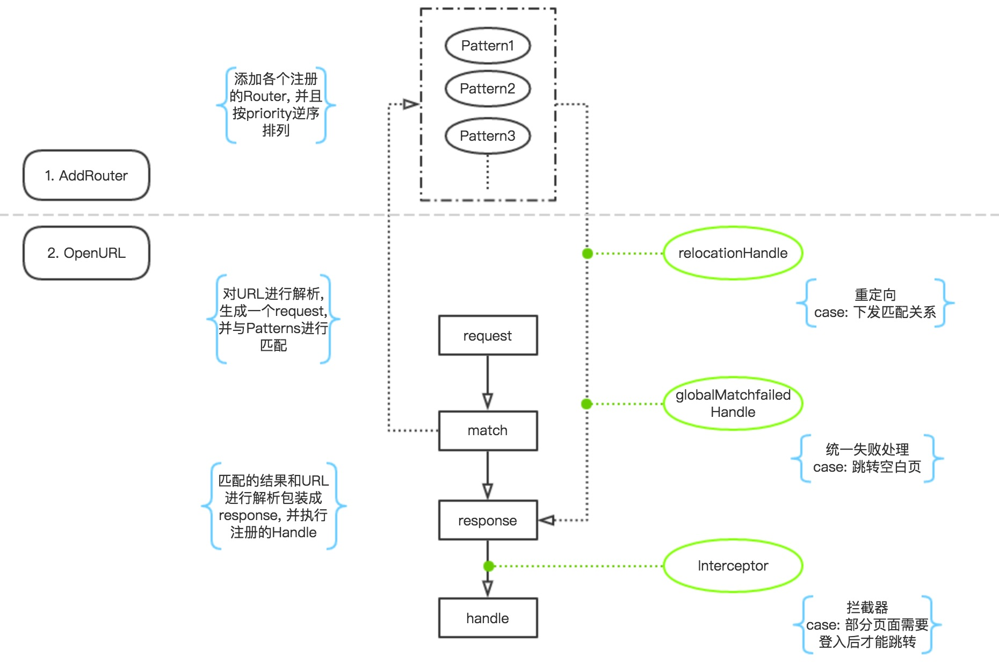

# ACRouter

[](https://travis-ci.org/260732891@qq.com/ACRouter)
[](http://cocoapods.org/pods/ACRouter)
[](http://cocoapods.org/pods/ACRouter)
[](http://cocoapods.org/pods/ACRouter)

## 简介

针对swift的页面路由 [路由的理解](Notes.md)

## 要求

swift3+ and xcode8+

## 安装

```ruby
pod "ACRouter"
```

## 总体流程


## 快速使用

1. 需要路由的控制器遵守协议`ACRouterable`, 并实现方法`registerAction`.
``` swift
class CustomViewController: UIViewController, ACRouterable {
    static func registerAction(info: [String : AnyObject]) -> AnyObject {
        let newInstance = LoginViewController()
        if let title = info["username"] as? String {
            newInstance.title = title
        }
        return newInstance
    }
}
```
2. 注册路由
``` swift
ACRouter.addRouter("AA://bb/cc/:p1", classString: "CustomViewController")
```

3. 通过URL打开控制器
``` swift
ACRouter.openURL("AA://bb/cc/content?value1=testInfo")
```

## 便利方法
- 快速添加路由映射关系
``` swift
let registerDict = ["AA://bb/cc/:p1" : "CustomViewControllerOne", "AA://ee/ff" : "CustomViewControllerTwo"]
ACRouter.addRouter(registerDict)
```

- 快速生成跳转URL
``` swift
//自动将参数params和jumptype嵌入到注册的URL当中
ACRouter.generate(_ patternString: params:  jumpType: )
```

- 检查跳转URL
``` swift
canOpenURL(_ urlString: )
```

- 移除路由
``` swift
removeRouter(_ patternString: )
```

## 自定义使用
1. 添加路由, 自己配置优先级和HandleBlock
``` swift
//注册的路由将按优先级逆序排序
ACRouter.addRouter(patternString:  priority: handle: )
```

2. 请求URL
``` swift
//返回匹配的路由与所有解析出来的参数
ACRouter.requestURL(urlString: userInfo: )
```

## Todo list
- [X] ~~Add `Interceptor` for router~~
- [X] ~~Add Test for router~~
- [X] ~~Add `openURL` failed action~~
- [ ] Add `relocation`
- [ ] `openURL` not only support Viewcontroller jumping 

## 致谢
[JLRoutes](https://github.com/joeldev/JLRoutes) 、
[MGJRouter](https://github.com/meili/MGJRouter) 、
[ARoutes]() 

欢迎提出你们宝贵的意见, 你们的star与issue是我前进的动力


## License

ACRouter is available under the MIT license. See the LICENSE file for more info.
